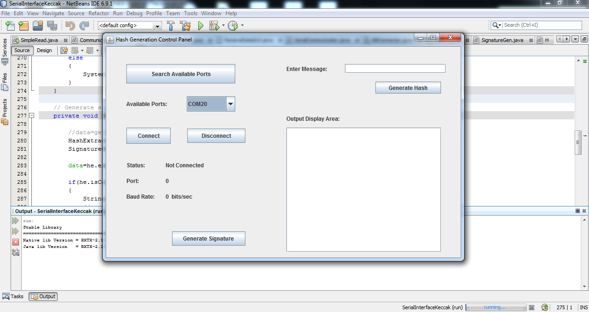
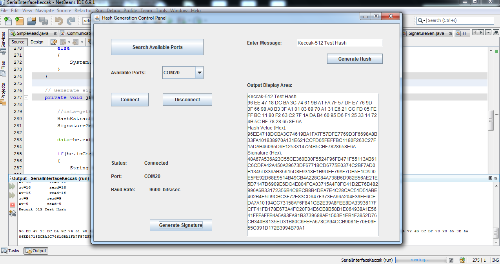

# Keccak_Interface

This repository contains the Java based code for interfacing the TM4C123GXL with the desktop application. It was a part of my M.Tech. thesis work. The other part of the code (for microcontroller) is in Keccak_CortexM4F repository. 

* This project was built using Netbeans IDE.

* The TM4C123GXL needs to be connected, with the program loaded. Check COM ports and necessary drivers for the TI board. 

* A snapshot of the interface is given below.

## Description

Using the JavaRXTX library, an interface based on the Swing framework was designed. The interface was used to communicate with the microcontroller, using the serial COM port. Moreover, it can communicate with any serially connected device. The following functionalities were provided which are illustrated thereafter.

* Search for available COM ports.

* Connect to a port using a baud rate of $9600$ bits/sec.

* Transmit text messages to the device using the output buffer stream.

* Read the incoming data via the COM, display it in a display area and save it in a log file.

* Disconnect from the serial COM port.

* Generate digital signature using RSA-2048 and by reading the text from the log file, process it to verify that it is, in fact, 512-bit hash value and encrypt it using the RSA-2048 private key, after generating a new pair of keys.

